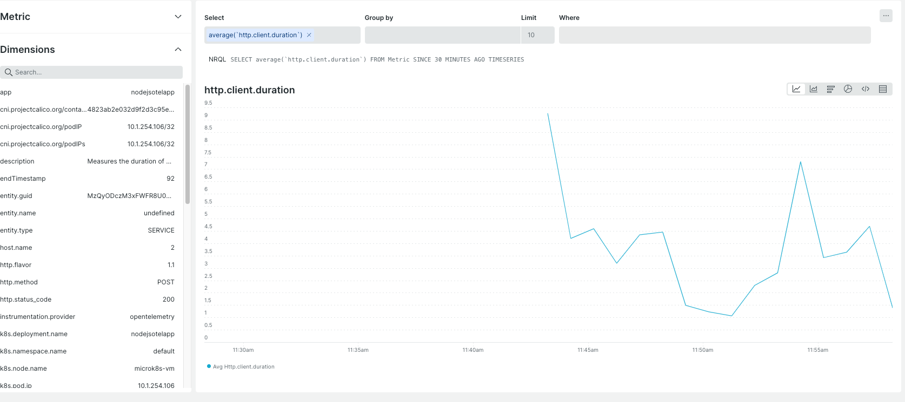

# nodejsk8sotelcollector

## To build demo app

```
docker build . -t ADDIMAGENAME --platform=ADDDESIREDPLATFORM
docker push ADDIMAGENAME
```

## To install Otel collector

```
helm repo add open-telemetry https://open-telemetry.github.io/opentelemetry-helm-charts
helm repo update
helm upgrade --install otel-collector open-telemetry/opentelemetry-collector --set config.exporters.otlp.headers.api-key="YOUR_INGEST_LICENSE_KEY" -f values.yaml
```

## To install demno app
```
kubectl apply -f app.yaml
```

